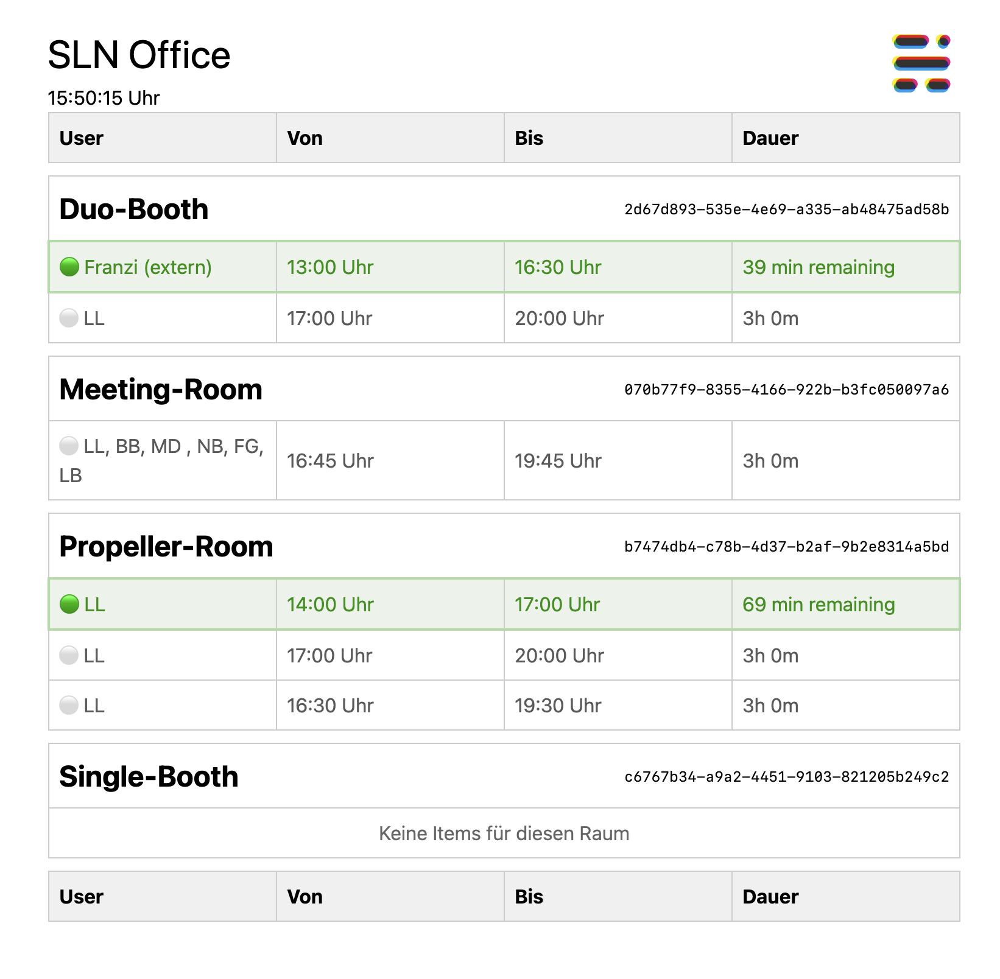
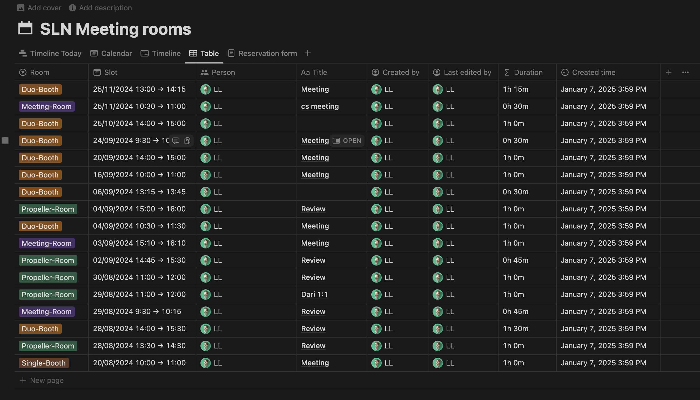

# SLN meeting room service

- This is a very simple meeting room display.
- It conntects over the Notion API to [our meeting room board](https://www.notion.so/stadtlandnetz/e724a89830bf4f7eb28f1e48248ea130?v=143c0d18854180adb3fe000c3780cab5):
- It provides two ways:
  1. An easy API for pulling the items per room.
  2. A simple frontend to display all bookings.




# How to use
- [Create a Notion integration](https://www.notion.so/profile/integrations)
- Apply this integration to your meeting room database. 
  - [Use this database template](https://stadtlandnetz.notion.site/174c0d1885418019bb84ea382e01bb73?v=174c0d18854181928e6f000cdcd457fd)
  - Click the duplicate icon in the top right corner in order to copy the template into your Notion instance.
- Put the database-id and the API-token in a .env variable.
```
    NOTION_TOKEN=YOURTOKEM
    NOTION_DATABASE_ID=YOURDATABASE
```
- run `npm i`
- run `npm run dev -- --open`
- the server starts and you can access mainpage as well as the API-subroutes